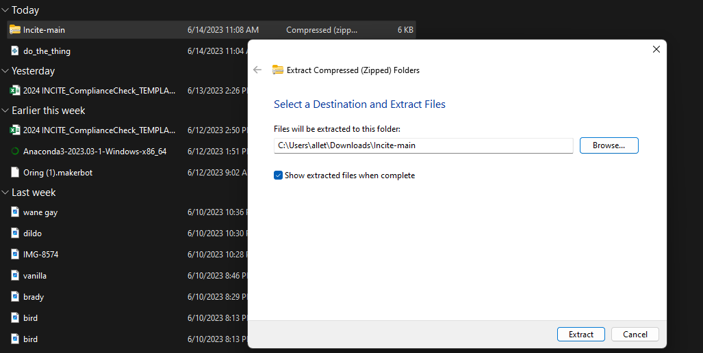
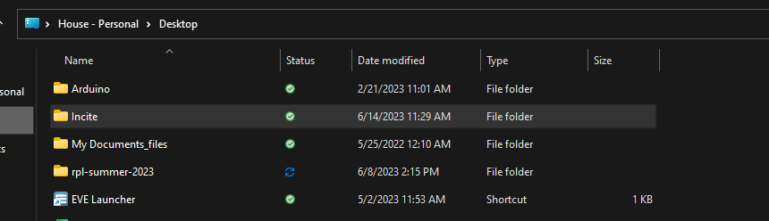
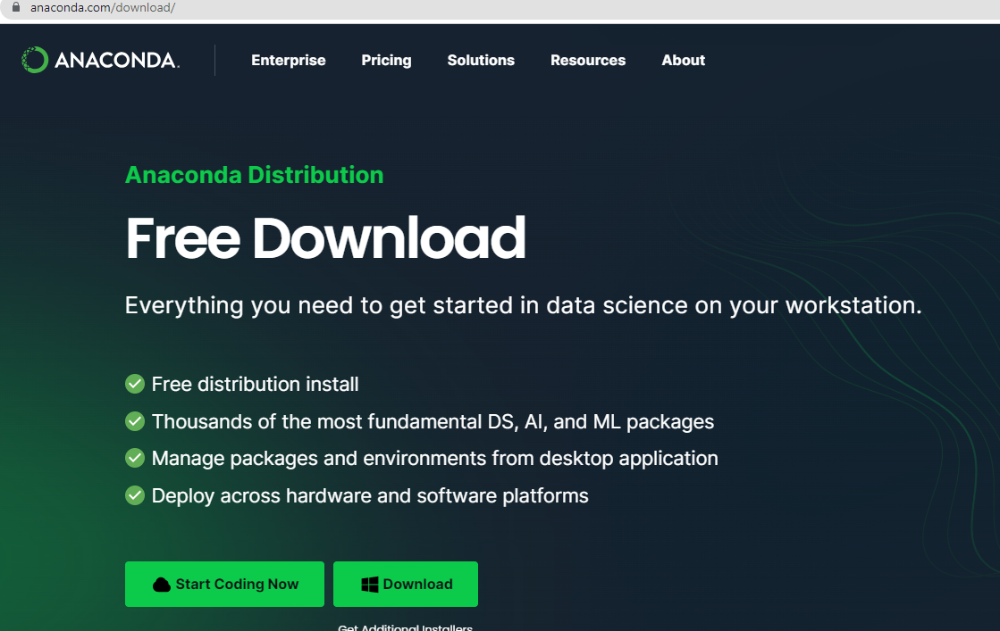
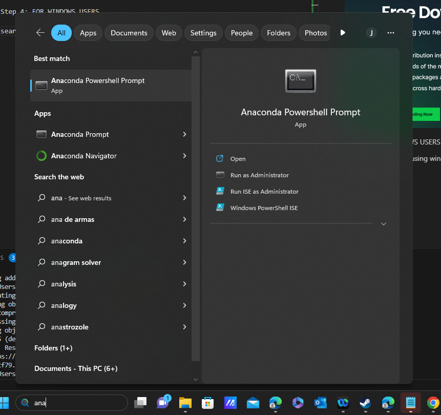
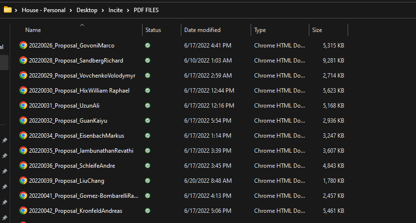
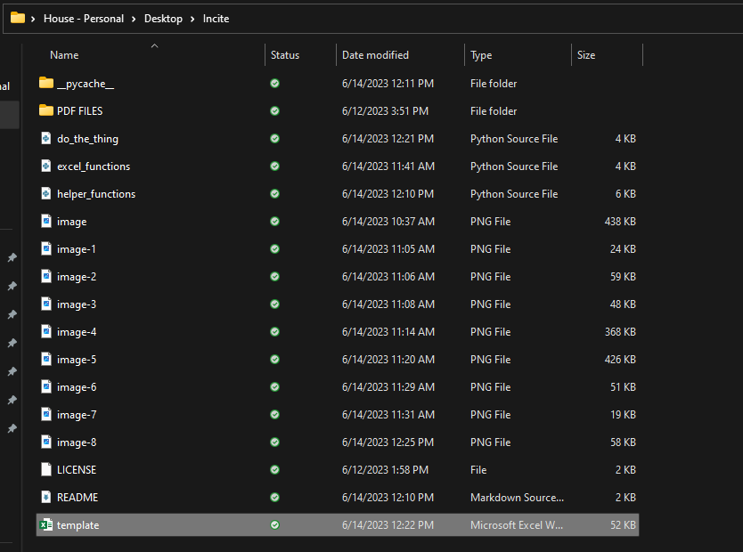
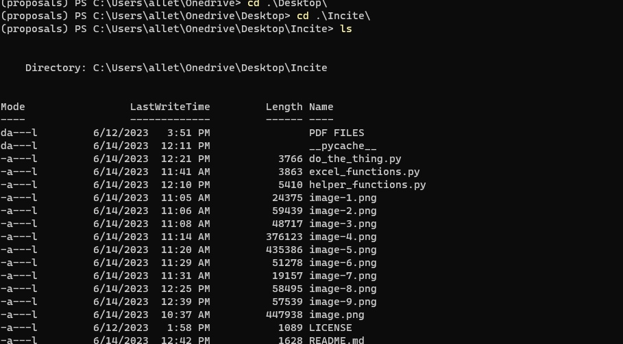

# Incite
## Running the proposal code steps:
STEP 1: Click on green code button

STEP 2: Click download zip, and then unzip the folder

STEP 3: Transfer this folder into your desktop by extracting the files and browsing into your desktop folder.

Now your new files should be able to be found when you look in your desktop files.

STEP 4: If not installed already, download Anaconda

Link to install anaconda.com/download/ : 

Step 5: FOR WINDOWS USERS

search for anaconda using windows search bar

use anaconda powershell prompt(will not work with regular anaconda prompt)

STEP 6: For MAC/LINUX open a terminal window 

(On MAC, terminal window can be opened from the utilities folder in your Applications )

STEP 7: Begin installing neccesary packages

In your terminal window, type the following commands one at a time and hit enter

    'conda install pip'

You will now begin pip installing all packages(press enter after each line)

    'pip install PyPDF2'

    'pip install PdfReader'

    'pip install textract'

    'pip install openpyxl'

    'pip install pdfplumber'

STEP 7: Create a folder inside of your new incite folder named PDF FILES that will hold all the proposal PDFS (as shown in picture below) 

STEP 8: Open a new excel sheet that will act as a blank template for data to be entered. Call this excel sheet "template" and add it to your incite folder.

STEP 9: Running your code in your terminal(scroll down for LINUX/MAC)

Step 10(windows users): Within your anaconda powershell prompt window open, locate to your code so that we can run the script.  Enter the following commands line by line until you reach the desired location

    'conda activate proposals'

    'cd Desktop'

    'cd Incite'

    'ls'
you should now be here 

now enter in the following command 

    'python do_the_thing.py'

Now everything should have run correctly and you are done!
You can view your completed excel sheet in the updated incite file.

